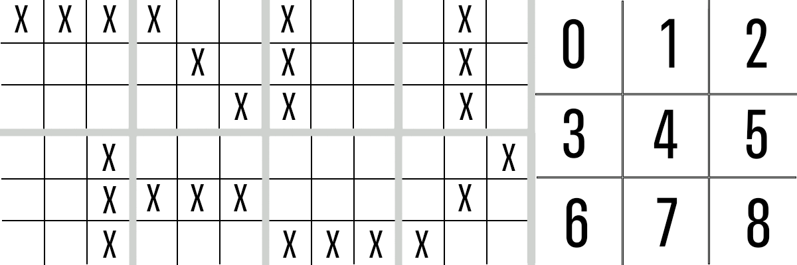
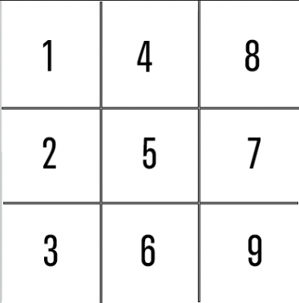

# Tic-Tac-Toe - Naveen Bhatti - General Assembly Software Engineering Immersive
## Introduction
This is a project conducted within my General Assembly Software Engineering Immersive. The goal of the project is to create a tic-tac-toe game using HTML, CSS, and Javascript. The exact requirements are specified by GA with styling being up to the software engineering student. Below there are sections related to various problems/bugs experienced throughout the project as well as some items that aided in my thought process.

## Possible Win Combinations
Below is a picture of the solutions that can be possible for the tic-tac-toe game as well as a legend for the grid shapes.

## Bugs Encountered
### Full Board + Last Turn Win Produces a Tie
The first bug encountered was found initially by randomly clicking on the grid, which resulted in the winning move occupying the last empty spot on the board. While this is supposed to produce a Win for a single user, the message output was a Tie. I begin troubleshooting by figuring out the set of moves that resulted in the above situation, which ultimately led to the figure displayed.

I solved the issue by re-examining the getWinner method. The issue occurred because the method checked if the first solution (A win across the top row) was valid, but in this case it was not. The method then checked, through a if-else, if the board was full. Due to this condition being true, it returned a tie without checking the rest of the possible solutions.
This was resolved by removing the condition from the if-else loop and putting it after the check for a null winner as seen in lines 107-121 of the app.js file.

### Click Between Squares Skips Initial Turn
The second bug encountered was when the space between spaces was clicked it would skip the first turn of the game. This is because I chose to use bubbling on the section rather than separate event listeners on the square objects. This was easily resolved by checking if the clicked element was a square block prior to handling completely.

